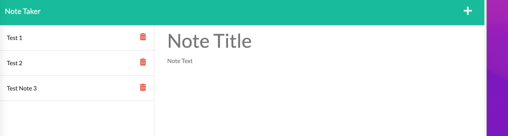

# note_taker

## <Project Note Taker>

## Table of Contents 

* [Description](#description)

* [Technologies Used](#technologies)

* [User Guide](#User-Guide)

* [LinkToSite](#LinkToSite)

* [Questions](#questions)

## Description

This app deployed through Heroku allows a user to write out and save notes.  

## Technologies
node.js, Express.js, HTML

## User-Guide

Use the live Heroku URL to open the deployed application and you will be presented with a landing page with a link to the notes page.
 

 
Clicking on the 'Get Started' button will bring you to the Notes page. The user will be presented with existing notes in the left hand column and empty fields to enter a new note in the center of the page.
 

 
When a user types in a new note title and text, they can then proceed by clicking on the disk icon in the upper right hand corner to save the note to the left hand side of the page. 
 

 
The user can continue to add notes and save them as described above. Coming soon- the user will be able to also delete the saved notes to provide better organization. 

## Link to Github
<https://github.com/jennyrae818/note_taker>

## Link to Heroku Deployed Page
<https://vast-cove-53640.herokuapp.com/>

## Questions

If you have any questions about the repo, open an issue or contact [jenny](undefined) directly at jennyrae818@gmail.com.

